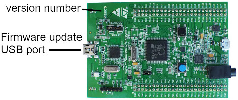

This guide collects all information you need to build Wunderkiste.

The build will take anywhere from a full day to multiple days depending on your tools and experience. This guide is written so that you can follow along step by step. Don't be afraid - some basic soldering experience should be the only thing you need to know to sucessfully finish this project.

Take your time, make breaks and keep your workspace clean. As often with tech-DIY projects it's well worth to build slowly and stay focussed. Being carefull now saves you a lot of hassle later in the troubleshooting process. Should something go wrong, there's always a way to recover. In this guide, there are troubleshooting tips with some common problems and solutions for them.

# What you should know before you start

Before you start, [download the latest release](https://github.com/TheSlowGrowth/Wunderkiste/releases/latest). It contains the firmware files, the bill of materials (BOM), drilling templates and more.

This project requires a lot of soldering. Most of it is pretty simple to do, but there are a couple of difficult parts, too. If you've done soldering projects in the past you don't have to worry. If you've never soldered anything before, I suggest you pick up a basic soldering project to get familiar with the process. It's certainly not rocket science and anyone can do it after a little bit of practice. Trying a cheap and small project first is ideal: You can quickly get familiar and feel the joy of success - but at the same time there's only a low risk and no expensive parts involved. Once you feel confident in your soldering you can safely start building a bigger project like Wunderkiste.

# Tools & Software

Before you get started, pick two boxes: One box for the parts, one box for the tools. Whenever you need to pause the build, you can just put everything back into the boxes and go on later.

These are the recommended tools for the electronics assembly:

- **An electronics soldering iron**. A cheap one will serve you well, but please get one that is temperature controlled. A soldering tip that is too hot or too cold will make it close to impossible to create good and reliable solder joints. Before you start with this project, you should have some basic soldering experience. 
- **"B series" soldering tip** for your soldering iron. I suggest a tip diameter of roghly 1-2mm. It seems counter-intuitive but smaller tips actually make it harder to create good solder joints because they don't have enough thermal mass and quickly drop in temperature as soon as you start soldering.
- **Resin core solder**.
- **Desoldering wick**. Don't even start without this. You'll need it at some point to suck away solder where you've applied too much.
- **Soldering flux**. Many people attempt to solder without proper flux. _That is a huge mistake_. Soldering flux is like magic: A) It makes the solder flow nicely instead of getting dry and sticky. B) It makes solder bridges separate. C) It makes you happy! The resin core inside the solder itself is enough for basic solder joints. But eventually, you'll end up with a solder joint that just won't "flow" and nothing seems to work. This is where flux comes to your rescue. **Don't get the stuff they sell at hardware stores.** It's meant for plumbing work and often it's corrosive. Get a "no clean" flux pen for fine pitch soldering work. Yes, it's expensive but it pays off.
- **Side cutters** for cutting wires, component legs and stripping isolation.
- **Tweezers and pliers**. Something basic is fine.
- **A hot glue gun**.
- **A deskmat**. I personally use a simple cardbord sheet. You'll regret not having used one once you burned a hole in your table :-)
- **A couple of zip ties** for attaching the battery pack
- **A vice** as a cheap crimp-tool for the IDC cables.
- **A simple multimeter** to measure voltages and continuity.

These tools are required for making the case:
- **A drill and drill bits in various sizes**.
- **A stepped drill bit** with 2, 4, 6, 8, 10 and 12mm steps is highly recommended for making the large holes for the front panel controls. 
- **A hole saw** for cutting the speaker holes. **TODO: Add diameter**
- **Screw drivers**. Flathead and Phillips
- **A "snap-off blade" utility knife** for cutting the SD card slot and the USB port opening.
- **Spray paint**. I suggest to use a plastic primer before and a clear coat after the actual paint job.

# Parts

Open the `BOM.xlsx` spreadsheet file you downloaded earlier. It contains all the electronic parts needed for the build, including order numbers for some webshops. If you can't get the exact same part, pick a replacement that matches the specifications written in the commentary columns.

The two circuit boards must be ordered from a PCB prototyping service like oshpark or any chinese PCB service. You can use the gerber productions files from the `gerbers` folder in `PCB_Files.zip`, which you downloaded earlier. Hopefully, if this project gains traction, we'll later be able to provide PCBs via webshops or group buys.

# Circuit board assembly

Open the interactive BOM from the `ibom` folder in `PCB_Files.zip`. It is a website generated from the circuit board design files where you can interactively find and view each component. In addition, you can checkmark what you've already completed.

Put aside the front panel LED. It's best to solder it with the PCB inserted into the case, so that it lines up nicely with the hole. It doesn't matter in which order you solder the remaining parts, but it is suggested to start with smaller ones and work towards the bigger parts like this:

1. Resistors (all parts named `R*`)
2. Capacitors (all parts named `C*`)
3. Diodes (all parts named `D*` - don't place the LEDs yet)
4. The power MOSFET Q1 and the speaker amplifier chip
5. The SD card slot - this is the trickiest of them so take your time and use flux
6. The volume potentiometer: Attention, it goes on the opposite side so that it faces upwards while all other components face downwards
7. All connectors and remaining parts.

The RFID board needs some special attention. 
1. Screw the RFID board in place using the M2.5 screws.
2. Observe the pins on the RFID board and the Wunderkiste PCB. These boards come with different pinouts.
3. Solder wire bridges between the board and the Wunderkiste PCB so that `MISO` connects to `MISO`, `SCK` connects to `SCK` and so on.

# Power bank installation

The power bank needs some special attention. At a minimum, you must attach a charging input wire, ground wire and an output wire to the power bank so that it can be connected to the 3pin Molex connector `J3` on the Wunderkiste bottom PCB. If you want, you can also break out the status LEDs and status button to the back of the Wunderkiste case by attaching wires for the ribbon cable `J1`. This is optional, though.

The instructions given here assume that you use the recommended Intenso A5200 power bank. Other power banks can work fine as well if they have the same features (USB 5V charging input port, USB 5V output port, physical button (no capacitive touch button) and up to 4 status LEDs).

1. Remove the stickers on both sides of the A5200 power bank. Under them you'll find screws which you have to remove. Aftwards, the plastic side pieces can be removed.
2. With the side pieces removed, push the internals out of the metal casing.
3. Undo the screws that attach the power bank PCB to the plastic frame so that you can reach the underside of the PCB.
4. Temporarily desolder the two battery wires (mark which wire goes to which terminal first!) so that the PCB is dead and safe to solder on.
6. Solder a black wire to the ground pin of the USB-A output connector.
7. Solder a red wire to the 5V pin of the USB-A output connector.
8. Find the 5V pin of the USB-micro-B input connector. The pins of the connector are super tiny, so you won't beable to attach a wire directly to them. However, you can follow the copper on the PCB to find a nearby spot which you can solder the wire to. There are different revisions of this power bank sold under the same name, but most of them have a test point close to the USB-micro-B input connector which you can directly solder the wire to.
9. Put the power bank onto its final spot on the PCB and shorten the three cables so that they reach the J3 connector nicely. Give them about 2cm extry length, just in case. It's a good idea to twist or braid the three cables so that they stay close together. Do that BEFORE you cut them to size.
10. Attach Molex metal contacts to each of the three wires and push them into the 3pin Molex KK connector housing so that they can be attached to `J3`. Be extra careful so that each wire ends up in the correct position! The silk screen markings next to `J3` indicate which wire goes where.
11. If you want to break out the status LEDs and the status button, follow these steps as well:
    1. Desolder the original button and LEDs from the power bank PCB. It usually helps to soak them in a generous blob of hot solder so that both pins can be undone at the same time. Be carefull not to damage any other components nearby. 
    2. Crimp a connector to one side of a 10pin ribbon cable. A vice will work just fine as a simple crimping tool.
    3. Cut the ribbon cable to size and separate at least 4cm of the wires on the other side so that they can be attached to various places on the power bank PCB.
    4. Take a look at the schematic PDF file from the `pdf` folder in `PCB_Files.zip`, which you downloaded earlier. Here you can see where the individual wires of `J1` need to be connected so that the button and LEDs on the Wunderkiste PCB end up connected to the corresponding pads on the power bank PCB.
    5. Start with the two wires for the status button. Remove the isolation and twist the individual copper wires. Soak them in solder. Afterwards, cut the wire end so that the exposed end is no longer than 2mm. Attach the wire to the contact pad on the power bank PCB.
    6. Do the same with the wires for each of the LEDs. Pay attention to the polarity. On the power bank PCB, you'll find little `+` markings next to each LED.
12. Reattach the battery wires to the pads from which you had disconnected them earlier.
13. Connect `J3` and `J1` to the Wunderkiste main PCB. Check that the status button and status LEDs work as intended. Connect a power source to the Wunderkiste USB socket and check that the power bank charges. Check that pin 1 of `J3` (marked `Discharge`) has 5V on it.
14. Disconnect `J1` and `J3`. Now that you know everything works, __carefully__ bend the wires so that the power bank PCB can be reattached to the plastic frame. After you're sure it fits, **soak** the power bank PCB in hot glue so that the fragile wires don't come off the first time you child drops the Wunderkiste to the floor.
15. Re-attach `J1` and `J3` and check once again that everything still works.
16. Finally, attach the power bank securely to the Wunderkiste PCB using zip ties.

Congratulations, this was the most fragile part of the Wunderkiste build and you rocked it!

# Speakers, buttons, jacks and other wiring

Connect red and black wires to the speaker `+` and `-` terminals respectively. Attach Molex KK contacts to the other ends and push them into the two 2pin Molex KK connector housings. It's not important which of the two pins is the `+` and the `-` side, but it's **very important** that you do it identically for both speakers. Otherwise one speaker would be moving inwards when the other moves outwards - effectively canceling each other out and resulting in a weak low frequency response.

Connect wires and Molex KK connectors to the two buttons in the same way. 

Connect wires and a 5 pin Molex KK connector to the 3.5mm headphone jack. The markings on the Wunderkiste PCB tell you which wire needs to go where: `Ring` needs to connect to the ring of the 3.5mm jack, `RingSw` connects to the switching contact that becomes disconnected from the `Ring` contact when a jack is pushed into the socket. The same goes for the `Tip` and `TipSw` contacts. Don't forget the `GND` contact that needs to be connected to the sleeve ov the 3.5mm jack.

Solder three wires to the ground, tip and ring contacts of the headphone jack on the STM32F4 Discovery board. Braid or twist the wires and add a 3pin Molex KK connector to the other end so that it reaches the audio input connector `J9` on the top PCB.

Finally, crimp a connector to both sides of the 16 pin ribbon cable that will later connect the top and the bottom board.

# Power test

First, connect all parts together: Connect the speakers, buttons, audio inout and the headphone jack to the top PCB. Connect the top PCB and bottom PCB. Insert the STM32F4 Discovery board into the sockets on the bottom PCB.

Press one of the buttons: You should see LEDs light up on the STM32F4 board AND on the RFID board which usually has its own little power LED. Release the buttons and the LEDs turn off. If that's not the case:
1. Check if there's ~5V on the `Discharge` pin of `J3`. If not, your power bank may be empty or the power bank wiring is not correct. You can connect a USB charger to the USB socket of Wunderkiste so continue with the tests.
2. Check that there's ~5V on the copper trace that connects `Q1`, `D5`, `D6` and `R7`. This is the input power __before__ the power switch MOSFET `Q1`.
3. Check that there's ~5V on the gate (pin 1) of MOSFET `Q1`. When you press one of the buttons, this voltage should drop to ~0V until you release the button again.
4. If conditions 1-3 are met then you should see ~5V on pin 2 and pin 4 of the MOSFET `Q1` while one of the buttons is pressed.

# Firmware installation

1. Connect a USB-mini-B cable to the STM32F4 Discovery board as shown in the image: 

2. Connect the other end of the cable to a computer / phone / tablet where you'll see a "USB thumb drive" appear (In case it doesn't appear, check the version number as shown in the image above: It should read "MB997**D**". If the last letter is an A, B or C, your board is too old to support drag & drop flashing and you'll have to use another method of flashing the firmware, see the info box below.)
3. Copy the firmware `*.hex` file to the drive. This file was part of the Zip file you downloaded in the beginning. You should see an LED on the STM32F4 Discovery board flash red/green during the file transfer. 
4. After the transfer is complete, eject the drive (!) then disconnect the USB cable. The firmware update is now complete.

  
How to update from older board versions!

  
  - If your board version is "MB997**A**" or "MB997**B**" or "MB997**C**", you can't simply program a new firmware by dragging and dropping a file. These boards have an older version of the programmer that doesn't support this feature.
  - The firmware download will be done with `openocd`, a commandline utility for debugging and flashing.
  - On windows:
    1. Download `openocd` from the [xpack project github release](https://github.com/xpack-dev-tools/openocd-xpack/releases). It probably doesn't contain an installer. Simply extract the folder contents somewhere on your harddrive, then add the path to `openocd.exe` (in the `bin` subdirectory) to your system PATH environment variable.
    2. Download and install the ST-LINK/V2-1 USB driver [from the ST website](https://www.st.com/en/development-tools/stsw-link009.html)
    3. Download the `*.hex` firmware image file [from the latest release](https://github.com/TheSlowGrowth/Wunderkiste/releases/latest)
    4. Open a command prompt `Start > Run > "cmd"`
    5. In the terminal window, navigate to the folder where you downloaded the `*.hex` firmware image using the `chdir` command: `chdir path\to\your\download\folder`
    6. Copy this line into the terminal window: `openocd.exe -f interface/stlink-v2-1.cfg -f target/stm32f4x.cfg -c init -c "reset init" -c "flash write_image erase Wunderkiste.hex" -c "verify_image Wunderkiste.hex" -c "reset run" -c shutdown`
    7. You should see a bunch of messages that ultimately say `verified XXX bytes in 0.XXXs (XX.XX KiB/s)` and `shutdown command invoked`
    8. The firmware download is complete.
  - On linux / macOS: 
    1. Download `openocd` from your package manager. (If that's not available, you may also use the [xpack project github release](https://github.com/xpack-dev-tools/openocd-xpack/releases). It probably doesn't contain an installer. Simply extract the folder contents somewhere on your harddrive.
    2. Open a terminal window. Add the path to the `openocd` executable file (in the `bin` subdirectory) to your search path with this command `export PATH="/path/to/openocd/binary:$PATH"`.
    3. Download the `*.hex` firmware image file [from the latest release](https://github.com/TheSlowGrowth/Wunderkiste/releases/latest)
    4. In the terminal window, navigate to the folder where you downloaded the `*.hex` firmware image using the `cd` command: `cd path/to/your/download/folder`
    5. Copy this line into the terminal window: `openocd -f interface/stlink-v2-1.cfg -f target/stm32f4x.cfg -c init -c "reset init" -c "flash write_image erase Wunderkiste.hex" -c "verify_image Wunderkiste.hex" -c "reset run" -c shutdown`
    6. You should see a bunch of messages that ultimately say `verified XXX bytes in 0.XXXs (XX.XX KiB/s)` and `shutdown command invoked`
    7. The firmware download is complete.

Remove the USB cable from the board.

# More testing

Now that the firmware is installed, we can finally do some actual tests.

1. Insert an SD card into the SD card slot and temporarily put the front panel LED into the corresponding holes in the top PCB. Will will solder this LED once the PCBs are installed in the case. For now it's enough to just stick it into the PCB loosly so that we can observe if the firmware is working as expected.
2. Press and hold one of the buttons. Power should turn on and **stay on** after you released the button. The front panel LED should light up in a steady green. 
    1. If the LED lights up in a steady red instead, you've inserted the LED in reverse. 
    2. If the LED blinks in red, Wunderkiste can't read the SD card. Make sure it is inserted and formatted as FAT32.
    3. If that doesn't help, check the SD card slot contacts and the resistors near the SD card slot.
3. After a while, the power will automatically turn off. Remove the SD card from the slot and put it in a computer. You should see a text file `library.txt`, which is empty.
4. Add a folder of mp3 files to the SD card.
5. Insert the SD card back into the Wunderkiste card slot and hold one of the buttons so that Wunderkiste turns on. You should see the LED blinking in a green-orange pattern (this indicates that Wunderkiste wants to assign an RFID tag to the newly added folder of mp3 files). Also the music from the new folder should start playing. If not:
    1. Try turning the volume knob. Maybe it was turned down?
    2. Try inserting headphones into the headphone jack. Can you hear something in the headphones? If yes, your speaker amplifier sections needs some fixing.
    3. If you can't get audio from the headphone jack, plug headphones directly into the audio output of the STM32F4 Discovery board (Attention: Loud!). You should hear audio playing. 
6. Put an RFID tag on top of the RFID reader board. Keep ~1-2cm distance to the board for optimal detection. The status LED should start flashing rapidly in green to indicate that the RFID tag was assigned to the new folder.
7. Remove the RFID tag. The status LED returns to a steady green and the music stops.
8. Put the RFID tag back. The music should start playing and the status LED will be orange. Check that you can navigate forwards and backwards through the mp3 files with the two buttons.

Congratulations, your Wunderkiste seems to work perfectly!

# Case assembly

Here you can get very creative! Any kind of case works, as long as it doesn't block the RFID signals.
The instructions here assume you're using the recommended Hammond plastic case.

1. Print out the drill template from the `pdf` folder in `PCB_Files.zip`, which you downloaded earlier. Make sure that the dimensions are accurate - use the test ruler on the print to see if you accidentally scaled it.
2. Place the template on the __inside__ of the top piece of the case (not the lid! The lid is the bottom side of the finished case).
3. Align the mounting posts on the inside of the case with the markings on the drill template. Use a center punch or a nail to mark the center of the drill holes for the volume potentiometer, status LED, headphone jack and the two buttons.
4. Drill the holes with a stepped drill bit and verify that all the components fit through the holes nicely.
5. Stick the status LED in the holes in the top PCB (check the polarity, otherwise red and green will be reversed!), then mount them into the case with the self tapping screws. You'll need some standoffs so that the PCB is ~10mm below the surface of the case. 
6. Solder the status LED. Now it's nicely aligned with your drill hole. You can now remove the top PCB from the case again.
7. Mount the bottom pcb on the "lid" of the case. Place the lid on the top part of the case and mark where you'll have to drill the holes for the status button, status LEDs and the reset button. Drill the holes. Remember that the reset button won't stick out of the hole - it's activated by sticking a needle / nail / wire into the hole, just like on other devices. Consequently, this hole can be much smaller than the other holes.
8. Again, place the lid of the case onto the top of the case and check that the LEDs and the status button match with the holes.
9. Mark where you'll have to make the cutout for the USB port and the SD card slot. For these, it's recommended to drill small holes around the perimeter of the cutouts and finish them with a "snap-off blade" utility knife. Fortunately the plastic of the case is very soft and you can easily cut it with the knife. It's tedious but easy.
10. Measure the distance between the mounting holes on the speaker drivers. Make a small drill template from paper where the center of the speaker and the four mounting holes are marked. Use a nail or center puncher to transfer the markings to the side of the case.
11. Use a circular drill bit to make the cutouts for the speakers on both side of the case - using the center marking your created with the template. The speakers mount from the inside of the case. The hole should allow the membrane to move freely while the metal frame of the speaker driver is mostly hidden inside the case.
12. Drill the four mounting holes for both of the speakers. 
13. To make the speaker covers, cut two square pieces of raw PCB material. They should be large enough to cover the speaker cutouts and the speaker mounting holes entirely. Drill the mounting holes and the speaker cutout into the two speaker covers. Sand the edges.
15. Cut two pieces of metal mesh material (e.g. from a frying pan grease splash guard) so that they can be sandwiched between the case and the covers that you made in the previous step. Also make holes for the four mounting screws.
16. Test the speaker covers by mounting them like this: 
    1. Place the mesh material onto the side of the case. 
    2. Add the speaker covers on top.
    3. Put M2.5 bolts through the covers, mesh and case.
    4. Add the speaker driver from the inside of the case.
    5. Secure the bolts with nuts from the inside of the case.
17. Now you can assemble the entire Wunderkiste and check if it all fits together. If the 16pin ribbon cable between the two PCBs is too long, it can push on the reset button on the STM32F4 Discovery board when the lid is closed. This would stop it from booting up. You can simply remove the reset button cap. That makes the button much smaller and harder to press accidentally. 
18. After you confirmed that it all works as intended, disassemble everything and paint the case.
19. After the paint is dry, add another coat of clear paint as a protection layer.
20. Consider glueing a layer of thin cork to the surface so that RFID tags don't slide off the top surface easily.

You're done! Congratulations!
