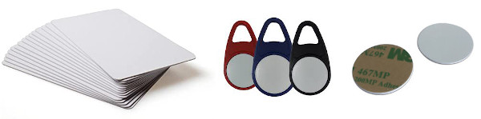

Wunderkiste is a music player for children. Its controls are extremly simple so that it can be used by children as young as 3 years. 
This manual contains all information needed to use it.

# Controls

 <table>
  <tr>
    <td><b>H</b></td>
    <td>Headphone jack. Mutes internal speakers when headphones are plugged in.</td>
  </tr>
  <tr>
    <td><b>S</b></td>
    <td>Status LED. Indicates what Wunderkiste is doing.</td>
  </tr>
  <tr>
    <td><b>V</b></td>
    <td>Volume control.</td>
  </tr>
  <tr>
    <td><b>P</b></td>
    <td>"Prev" button. Jumps to the previous track.</td>
  </tr>
  <tr>
    <td><b>A</b></td>
    <td>RFID - active "card area". Place cards / tags here.</td>
  </tr>
  <tr>
    <td><b>N</b></td>
    <td>"Next" button. Jumps to the next track.</td>
  </tr>
</table> 

 <table>
  <tr>
    <td><b>SD</b></td>
    <td>SD card slot.</td>
  </tr>
  <tr>
    <td><b>R</b></td>
    <td>"Reset" button. Push with a pointy object to reset   the Wunderkiste in case it hangs due to a software error.</td>
  </tr>
  <tr>
    <td><b>C</b></td>
    <td>Charging port. Connect to a USB phone charger to charge the internal battery.</td>
  </tr>
  <tr>
    <td><b>L</b></td>
    <td>Battery indicator LEDs. Show the battery level. (Optional)</td>
  </tr>
  <tr>
    <td><b>B</b></td>
    <td>"Battery" button. Activates the battery indicator LEDs. (Optional) </td>
  </tr>
</table> 

# Basic operation

1. Each piece of music is represented by a plastic RFID card. Alternatively, tags, figurines, etc. can be used instead.
2. Wake up your Wunderkiste by pressing (and holding) one of the buttons **P** or **N** until the status LED **S** lights up in green.
3. Place a card on the card area **A**. Wunderkiste will start playing the corresponding music from its SD card and the status LED **S** will turn yellow.
4. While the music is playing, press the **N** and **P** buttons to jump to the next / previous track.
5. To stop playback, simply remove the card from the card area **A**. The status LED **S** returns to green.
6. After a while of inactivity, Wunderkiste goes back to sleep. The status LED **S** turns off.
7. If there is an error, the status LED will start flashing in a pattern of red/green/yellow to show you what's wrong.

# Manage the music library

Each card plays MP3 files from a single folder on the SD card in alphabetical order. To determine which folder to play when a specific card is placed on the card area **A**, Wunderkiste maintains a _library_ that links folder names to the RFID cards. This library is stored in the `library.txt` file that Wunderkiste will automatically create on the SD card. Usually you don't have to edit this file, Wunderkiste will take care of it. 

## Prepare an SD card

Wunderkiste needs the SD card to be formatted as FAT32. Thankfully, new cards usually come formatted as FAT32 and you can just use them as-is. 

If you get the    error code when you wake up your Wunderkiste then you'll have to manually format the card before it can be used like this:

1. Format the card on a computer. On Windows, right click the card in Windows Explorer and select `Format`. On macOS, you can use the `Disk Utility` app to format the card. Make sure to select FAT32 as the file system. Usually this fixes any issues, but there are special cases where this doesn't work due to weird partitions on the card.
2. A safer way could be this: Insert the card into a digital camera and format the card via the camera menu. Most cameras use the FAT32 file system as well. The camera will most likely add some folders, like `DCIM` or `MISC`. Make sure to delete all of them so that the card is entirely empty before you use it with Wunderkiste. 

If Wunderkiste still can't read the card, try using another one.

## Prepare cards / tags for use with Wunderkiste

Wunderkiste uses RFID to detect objects that are placed on the active area **A**. There are various types of plastic cards, tags or stickers that work with Wunderkiste. They are usually quite cheap at online retailers. Here's what you need to know, when selecting cards / tags:

1. Search for "Mifare Classic 1K". This is an RFID protocol that Wunderkiste can read. You'll find various types of cards, tags and stickers, just like the ones in the pictures above.
2. The RFID chip in Wunderkiste is called _MFRC 522_ or _RC 522_ and it is used in many DIY projects. Usually, cards / tags are specifically sold as "MFRC 522 compatible".
3. To make the cards / tags easily recognizable for children you can modify them with photos, attach them to figurines or embed them in cuddly toys. Just make sure that the RFID chip inside the card / tag remains close to the surface of Wunderkiste so that the RFID communication is not negatively affected. My preferred choice are white RFID cards to which I glue a photo of the story / music associated with that card. For this, I print a photo on a photo printer and simply glue it to the card. The resulting cards are easy to handle, robust and can simply be put in a small box. They tend to get lost though, so using bigger objects can be beneficial, too. 
4. Before you invest time and effort into customizing the RFID cards / tags, [I suggest you pair them with music](#add-music) so that you can easily check if they work.

## Add music and pair it to a card

1. Add new music by copying folders of `*.mp3` files to the SD card. Each folder will later be linked to its own card. Place each folder directly in the root directory of the SD card, **don't use subfolders**. You can add multiple folders at once. Each folder should contain **only** `*.mp3` files (no subfolders, no CD cover image files, etc). The `*.mp3` files must contain audio at a sample rate of 44.1kHz, which is true for all MP3 files ripped from CD and almost all files that were provided as a digital download.
2. Place the SD card into the card slot on your Wunderkiste. 
3. Wake up your Wunderkiste by pressing (and holding) one of the buttons **P** or **N** until the status LED **S** lights up. Wunderkiste now detects that there are new folders for which it doesn't know a corresponding card yet. 
4. The status LED **S** starts blinking    and music from one of the new folders starts playing. Wunderkiste now waits for you to tell it which card should be linked to this folder.
5. Place an **unused** card (= not linked to any other folder) on the card area **A**. Wunderkiste will link this card to the folder and the status LED **S** starts rapidly flashing in green    to indicate that the folder was successfully linked to this card.
6. Remove the card from the card area **A**. If there are more unlinked folders, Wunderkiste starts playing the next folder (go back to 4.)
7. Once all folders are linked to their own unique cards, the status LED **S** lights up in green and Wunderkiste is ready to be used.

## Remove music

1. Locate the folder on the SD card that contains the music you want to remove and delete the entire folder.
2. Open the `library.txt` file on the SD card with a text editor.
3. You'll see many lines like this `<Some characters>:<A folder name>`. Locate the line for the folder which you just deleted and erase it. Then save the file. Now the card that was used for this folder is free to be used for new folder.

## Change/reset the card for a folder

If you would like to use a different card for a folder of music (= unlink the current card and link a new one), you'll have to remove the corresponding entry from the Wunderkiste library.

1. Open the `library.txt` file on the SD card with a text editor.
2. You'll see many lines like this `<Some characters>:<A folder name>`. Locate the line for the folder for which you'd like to change the card and erase it. Then save the file.
3. Place the SD card into the card slot on your Wunderkiste. 
4. Wake up your Wunderkiste by pressing (and holding) one of the buttons **P** or **N** until the status LED **S** lights up. Wunderkiste now detects that there is a folder for which it doesn't have a linked card yet. Follow the pairing process [described above](#add-music).

# Status LED codes

The status LED can be lit continuously or blink in a pattern to display what Wunderkiste is currently doing. 

| LED pattern | Description |
| ---- | ---- |
| off | Wunderkiste is sleeping. Wake it up by pressing (and holding) one of the buttons **P** or **N** until the status LED **S** lights up. If that doesn't work, the battery may be empty. Connect Wunderkiste to a charger and try again. |
|  (continuous) | Wunderkiste is awake and ready to play music for you. Place a card on the card area **A**. |
|  (continuous) | Wunderkiste is playing music. |
|    ---- | Wunderkiste can not read the SD card. [Make sure that it is formatted to a FAT32 file system](#prepare-card). |
|    | _Pairing:_ Wunderkiste plays a folder of music that is not yet linked to a card. Place an **unused** card on the card area to link it to this folder |
|    | _Pairing:_ Wunderkiste has successfully linked the card to the folder that is currently playing. Please remove the card to finish the pairing process. |
|   -   -   ---- | An internal error occured. Ooops. That should not happen. Please help fix this issue by providing a bug report on the [issues page](https://github.com/TheSlowGrowth/Wunderkiste/issues)!|

# Troubleshooting tips 

### My music sounds weird (pitched up/down, too fast/slow)
Please make sure that the `*.mp3` files are at a sample rate of 44.1kHz (standard CD sample rate). If not, you can use an audio editor like Audacity to convert the files to 44.1kHz.

### Wunderkiste just hangs and doesn't react
You probably hit a bug in the firmware. Oops. Sorry! Use a pointy object (e.g. paper clip) to press the reset button **R** on the back of your Wunderkiste. This should switch it off so that you can wake it up again. Please help fix the issue by providing a bug report on the [issues page](https://github.com/TheSlowGrowth/Wunderkiste/issues)!
